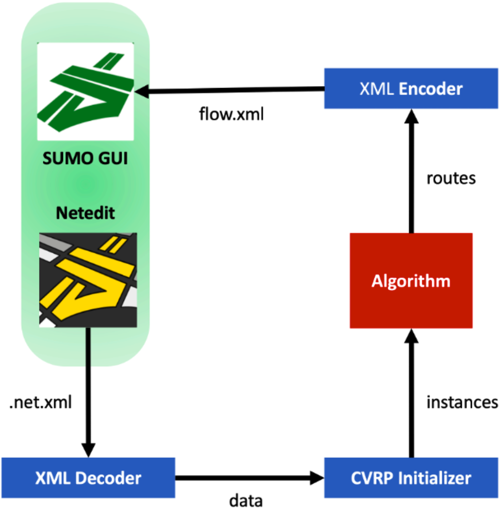

# SUMO-gym

OpenAI-gym like toolkit for developing and comparing reinforcement learning algorithms on SUMO.




## Installation

This software is under active development, it has not been published on PyPI, and some functions are still unstable. If you want to test and contribute to it, you can try this:

```shell
$ python3 -m venv env
$ source env/bin/activate
(venv)$ pip install -e .
(venv)$ pytest tests/
#(venv)$ python -m ipykernel install --user --name sumo_gym
```

## Features


```python
import gym
from sumo_gym.envs.vrp import VRP

env = gym.make('VRP-v0', n_vertex, n_depot, n_edge, n_vehicle, vertices, demand, edges, departures, ...)
for _ in range(n_episode):
    obs = env.reset()
    for t in range(n_timestamp):
        action = env.action_space.sample()
        obs, reward, done, info = env.step(action)
        if done:
            break
env.close()
```

SUMO-gym aims to build an interface between SUMO and Reinforcement Learning. With this toolkit, you will be able to convert the data generated from SUMO simulator into RL training setting like OpenAI-gym. 

**Remarkable features include:**

1. Powerful interface between SUMO simulator and OpenAI-gym liked RL training environment;
   
2. RL tranining models for some urban mobility problems (WIP).

P.S. *Will be a wheel later*.
