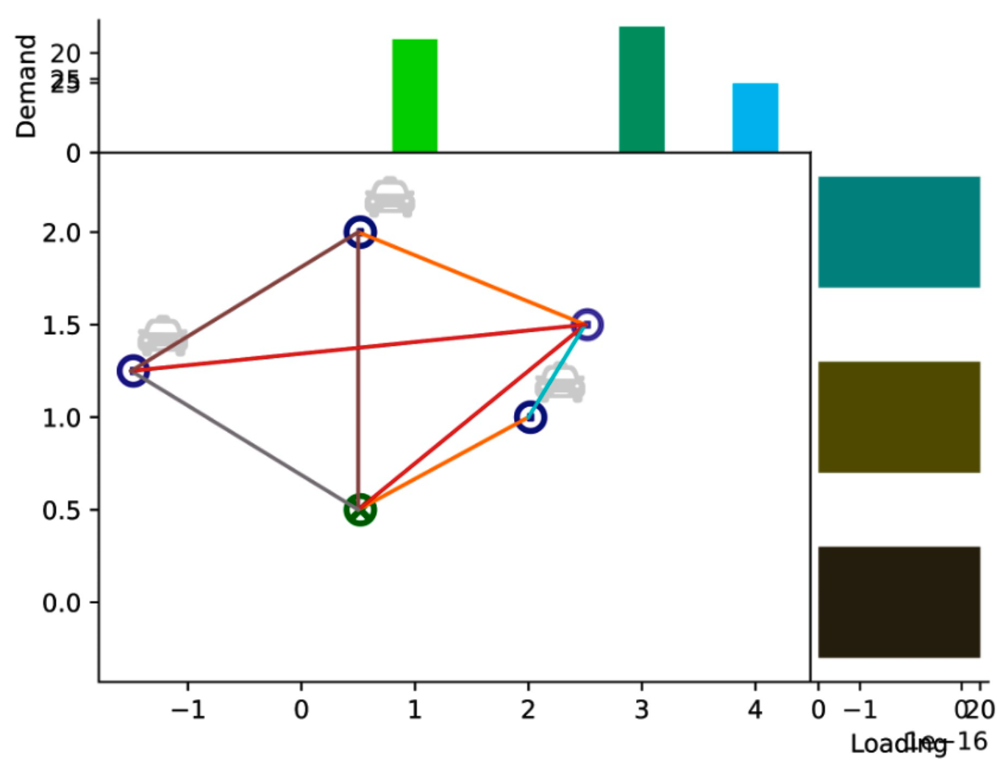

# SUMO-gym
<!-- ALL-CONTRIBUTORS-BADGE:START - Do not remove or modify this section -->
[](#contributors-)
<!-- ALL-CONTRIBUTORS-BADGE:END -->

OpenAI-gym like toolkit for developing and comparing reinforcement learning algorithms on SUMO.


## Installation

This software is under active development, it has not been published on PyPI, and some functions are still unstable. If you want to test and contribute to it, you can try this:

```shell
$ python3 -m venv env
$ source env/bin/activate
(venv)$ pip install -r requirements.txt
(venv)$ pip install -e .
(venv)$ pytest tests/
#(venv)$ python -m ipykernel install --user --name sumo_gym
```

## Features

SUMO-gym aims to build an interface between SUMO and Reinforcement Learning. With this toolkit, you will be able to convert the data generated from SUMO simulator into RL training setting like OpenAI-gym. 

**Remarkable features include:**

1. Interface between SUMO simulator and OpenAI-gym liked RL training environment;

```python
import gym
from sumo_gym.envs.vrp import VRP

env = gym.make('VRP-v0', n_vertex, n_depot, n_edge, n_vehicle, vertices, demand, edges, departures, ...)
for _ in range(n_episode):
    obs = env.reset()
    for t in range(n_timestamp):
        action = env.action_space.sample()
        obs, reward, done, info = env.step(action)
        if done:
            break
env.close()
```

2. Visualization rendering tools based on matplotlib for urban mobility problems.



3. Deep reinforcement learning models for urban mobility problems (WIP).

P.S. *Will be a wheel later*.

## Contributors ✨

Thanks goes to these wonderful people ([emoji key](https://allcontributors.org/docs/en/emoji-key)):

<!-- ALL-CONTRIBUTORS-LIST:START - Do not remove or modify this section -->
<!-- prettier-ignore-start -->
<!-- markdownlint-disable -->
<table>
  <tr>
    <td align="center"><a href="https://github.com/LovelyBuggies"><br /><sub><b>N!no</b></sub></a><br /><a href="https://github.com/LovelyBuggies/sumo-gym/commits?author=LovelyBuggies" title="Code">💻</a> <a href="https://github.com/LovelyBuggies/sumo-gym/issues?q=author%3ALovelyBuggies" title="Bug reports">🐛</a> <a href="#ideas-LovelyBuggies" title="Ideas, Planning, & Feedback">🤔</a></td>
    <td align="center"><a href="https://www.linkedin.com/in/yunhao-wang-871364aa/"><br /><sub><b>yunhaow</b></sub></a><br /><a href="https://github.com/LovelyBuggies/sumo-gym/commits?author=wyunhao" title="Code">💻</a> <a href="https://github.com/LovelyBuggies/sumo-gym/issues?q=author%3Awyunhao" title="Bug reports">🐛</a></td>
  </tr>
</table>

<!-- markdownlint-restore -->
<!-- prettier-ignore-end -->

<!-- ALL-CONTRIBUTORS-LIST:END -->

This project follows the [all-contributors](https://github.com/all-contributors/all-contributors) specification. Contributions of any kind welcome!